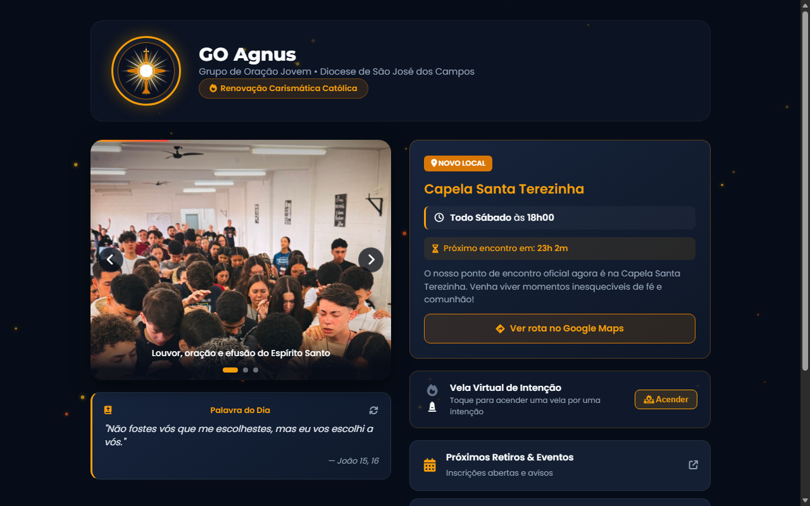

# GO Agnus

Página de apresentação e hub de links para o grupo de oração jovem GO Agnus.

Demo online: https://marcoserculianipw.github.io/go_agnus/



## Sobre o projeto

Desenvolvi este projeto de forma voluntária como proposta de canal digital e hub de links para o GO Agnus, grupo de oração jovem da Diocese de São José dos Campos (RCC) sediado na Capela Santa Terezinha. O objetivo foi reunir informações sobre dias e horários de encontro, rota no mapa e recursos interativos para a comunidade. A iniciativa não teve continuidade após a fase inicial, mas o código permanece como estudo e portfólio de desenvolvimento frontend com JavaScript puro.

## Funcionalidades

- Animação de partículas em elemento Canvas (`<canvas>`) com efeito visual contínuo de brasas no fundo da página
- Carrossel de fotos com transição automática, barra de progresso e suporte a toque (swipe) em dispositivos móveis
- Contador regressivo dinâmico calculando em tempo real o tempo restante até o encontro semanal de sábado às 18h
- Vela virtual de intenções interativa com alternância de estado visual
- Card com versículos bíblicos e alternância dinâmica de citações sem recarregar a página
- Integração direta com Google Maps apontando a localização da Capela Santa Terezinha
- Layout responsivo adaptado para smartphones e desktops

## Tecnologias

- HTML5 (Canvas API e elementos semânticos)
- CSS3 (Flexbox, CSS Grid e animações suaves)
- JavaScript puro (Vanilla JS)
- Font Awesome 6

## Como rodar localmente

Como se trata de uma aplicação estática, não há dependências de compilação ou execução:

1. Clone o repositório:
```bash
git clone https://github.com/marcoserculianipw/go_agnus.git
```
2. Abra o arquivo `index.html` diretamente em seu navegador.